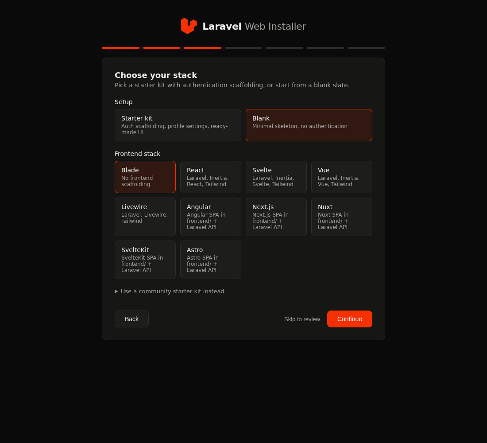

<div align="center">


<a href="https://github.com/thatobabusi/laravel-installer">
  
</a>

<br/><br/>

<a href="https://github.com/thatobabusi/laravel-installer/stargazers"></a>
<a href="https://github.com/thatobabusi/laravel-installer/forks"></a>
<a href="https://github.com/thatobabusi/laravel-installer/watchers"></a>

<a href="https://github.com/thatobabusi/laravel-installer/releases"></a>
<a href="https://github.com/thatobabusi/laravel-installer/commits/master"></a>
<a href="https://github.com/thatobabusi/laravel-installer/issues"></a>
<a href="https://github.com/thatobabusi/laravel-installer/pulls"></a>
<a href="LICENSE.md"></a>
<a href="https://github.com/thatobabusi/laravel-installer/graphs/contributors"></a>

<br/>

<a href="https://github.com/thatobabusi/laravel-installer/actions/workflows/tests.yml"></a>
<a href="https://github.com/thatobabusi/laravel-installer/actions/workflows/static-analysis.yml"></a>
<a href="https://github.com/thatobabusi/laravel-installer/actions/workflows/docs.yml"></a>

<br/>

**[🌍 Visit the Website](https://thatobabusi.co.za)** · **[📦 Releases](https://github.com/thatobabusi/laravel-installer/releases)** · **[📚 Docs](docs/README.md)** · **[📜 Changelog](CHANGELOG.md)**

</div>

<hr>

<h1 align="center">🧭 Overview</h1>

<div align="center">

A fork of <a href="https://github.com/laravel/installer"><strong>laravel/installer</strong></a> that adds a <strong>browser-based installer</strong>,
a full documentation set, and self-maintaining repository automation — while staying continuously synced with upstream. <br/><br/>
🖥️ <strong>CLI</strong> when you want speed | 🌐 <strong>Web UI</strong> when you want a guided wizard | 🤖 <strong>JSON mode</strong> when an AI agent is driving

</div>

```sh
laravel new my-app        # the classic CLI wizard
laravel web               # the same wizard, in your browser
```

<div align="center">

</div>

<h2 align="center">✨ Features</h2>

- 🚀 **Everything upstream** — starter kits (React, Svelte, Vue, Livewire), WorkOS auth, teams, database setup, Pest/PHPUnit, npm/pnpm/bun/yarn, Laravel Boost, Git and GitHub publishing.
- 🧭 **Project types** — full web app, **API-only** (Sanctum via `install:api`), **Filament dashboard**, or a package skeleton via `--type=...`.
- 🎨 **Vanilla UI presets** — scaffold blank applications with **Bootstrap 5**, **Bulma**, **UIkit**, **Pico CSS**, **CoreUI 5**, **AdminLTE 4**, or the **Laravel AdminLTE** package via `--ui=...`.
- ⚡ **SPA frontends** — pair the Laravel backend with **Angular**, **Next.js**, **Nuxt**, **SvelteKit**, or **Astro**, scaffolded in `frontend/` via `--spa=...`.
- 🧩 **JS enhancements & theming** — add **Alpine.js**, **HTMX**, **jQuery**, or **Stimulus** via `--js=...`, and give every project light + dark mode out of the box with `--theme`. See the full [stack roadmap](docs/stack-roadmap.md).
- 🌐 **Web installer** — `laravel web` serves a local wizard that walks every `laravel new` option, live-validates the project name, disables databases with missing PDO extensions, shows the equivalent CLI command before installing, and streams the install log to your browser.
- 🔒 **Loopback-only by design** — the web UI binds to `127.0.0.1`; an optional [Herd front controller](public/index.php) proxies it at a friendly `.test` domain.
- 🤖 **Agent-aware** — when run by an AI coding agent, the installer suppresses prompts and emits a machine-readable JSON result ([details](docs/agent-integration.md)).
- 📚 **Documented & self-maintaining** — narrative docs in [docs/](docs/README.md), a generated command reference CI keeps honest, weekly upstream syncs, and one-click releases.

<h2 align="center">🔭 Built With</h2>

<div align="center">

<a href="https://skillicons.dev">
  
</a>

</div>

<h2 align="center">🚀 Getting Started</h2>

| Purpose | Requirement |
| --- | --- |
| Run the installer | PHP 8.2+, Composer |
| Create Laravel 13 apps | PHP 8.4+ |
| Optional features | Git, a Node package manager, the [`gh` CLI](https://cli.github.com) (GitHub publishing) |

**From this fork (includes `laravel web`):**

```sh
git clone https://github.com/thatobabusi/laravel-installer.git
cd laravel-installer
composer install
php bin/laravel --version
```

Add `bin/laravel` to your `PATH`, or run it through your PHP of choice. [Laravel Herd](https://herd.laravel.com)
users can also link this repository with its document root set to `public/` to reach the web
installer at a Herd host such as `https://laravel-installer.test`.

**The upstream package (CLI only, no web UI):**

```sh
composer global require laravel/installer
```

<h2 align="center">🕹️ Usage</h2>

Create an application interactively, or script it with explicit flags:

```sh
laravel new blog
laravel new blog --react --database=pgsql --pest --pnpm --git --no-interaction
```

Launch the browser wizard from the directory that should contain new projects:

```sh
laravel web              # picks a free port (8123-8199) and opens your browser
laravel web --port=8123  # choose the port
laravel web --no-open    # don't open the browser automatically
```

See [Getting started](docs/getting-started.md) for recipes and the
[generated command reference](docs/reference/command-help.md) for every option and default.

<h2 align="center">📚 Documentation</h2>

| Guide | Covers |
| --- | --- |
| [Getting started](docs/getting-started.md) | Installing, creating apps, CLI recipes |
| [CLI guide](docs/cli.md) | `laravel new` and `laravel package` in depth |
| [Web installer](docs/web-installer.md) | `laravel web`, Herd setup, behavior and requirements |
| [Agent integration](docs/agent-integration.md) | JSON output contract for AI agents |
| [Command reference](docs/reference/command-help.md) | Generated `--help` for every command |
| [Maintaining docs](docs/maintaining-docs.md) | `composer docs:update` / `docs:check` |
| [Upstream sync](docs/upstream-sync.md) | How this fork tracks laravel/installer |

<h2 align="center">🤖 Repository Automation</h2>

| Workflow | What it does |
| --- | --- |
| `tests.yml` / `static-analysis.yml` | PHPUnit (unit + feature) matrix and PHPStan on every push and PR |
| `e2e.yml` | Playwright end-to-end tests against the live `laravel web` wizard |
| `docs.yml` | Fails CI when generated documentation is stale |
| `docs-sync.yml` | Regenerates the command reference on schedule and commits the drift |
| `upstream-sync.yml` | Merges `laravel/installer` weekly — PR on a clean merge, issue on conflict |
| `release.yml` | Manual dispatch: bumps the version, tags, and publishes a GitHub Release |

<h2 align="center">🤝 Contributing</h2>

<div align="center">

Issues and pull requests are welcome on this fork for <strong>web-installer and documentation</strong> changes. <br/>
Improvements to the core installer belong upstream in <a href="https://github.com/laravel/installer">laravel/installer</a> — they arrive here through the weekly sync.

</div>

<h2 align="center">📜 License</h2>

<div align="center">

Open-sourced software licensed under the <a href="LICENSE.md">MIT license</a>. <br/>
Built on the <a href="https://github.com/laravel/installer">Laravel Installer</a> by Taylor Otwell and the Laravel team. ❤️

</div>


