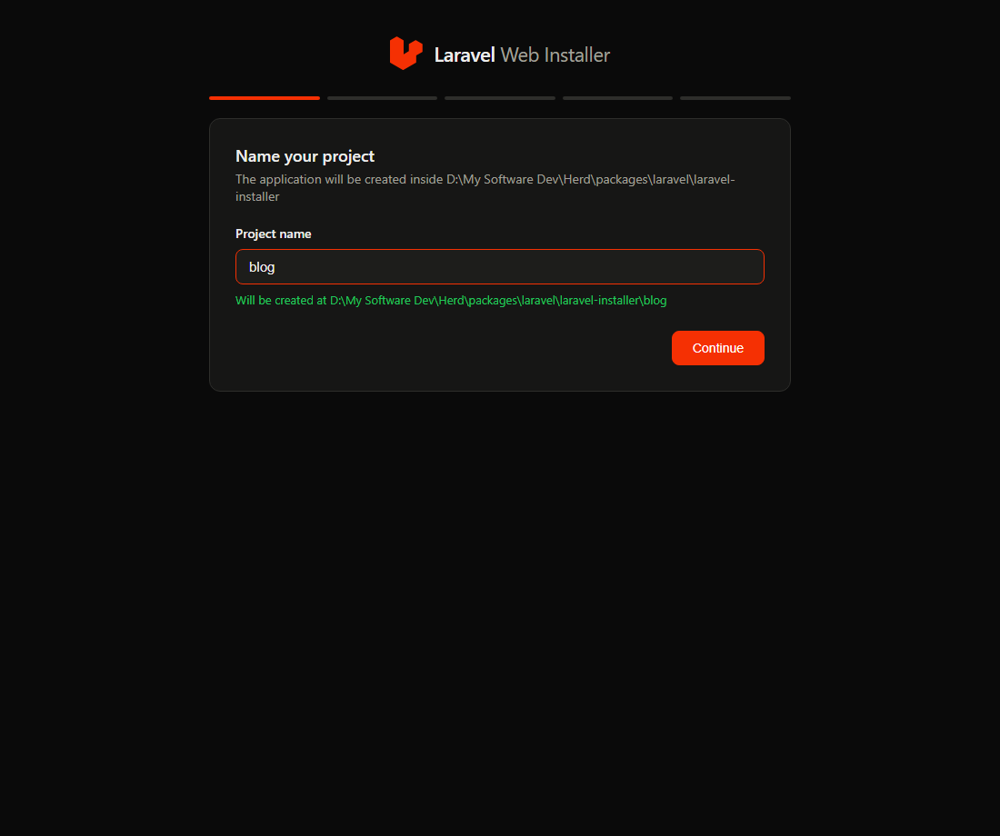
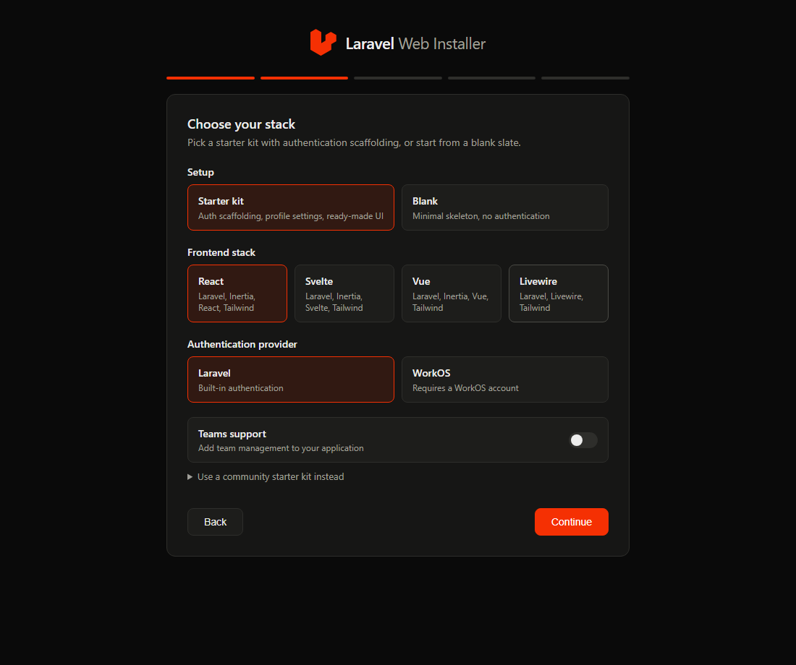
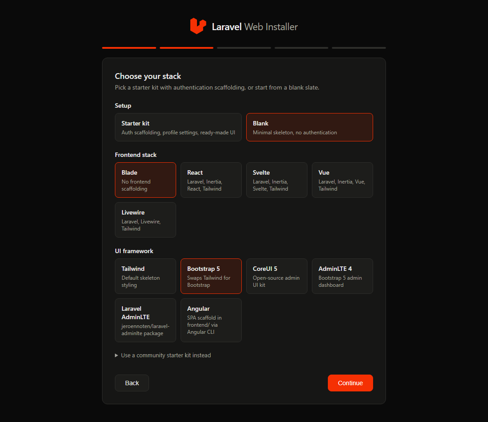
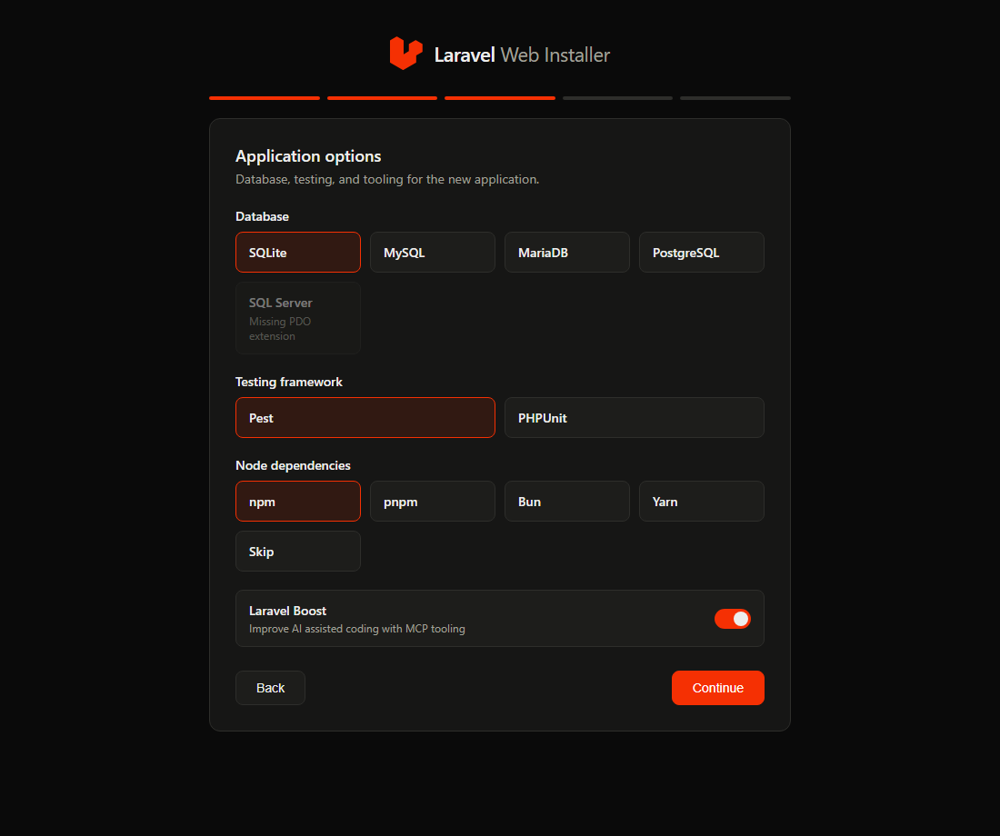
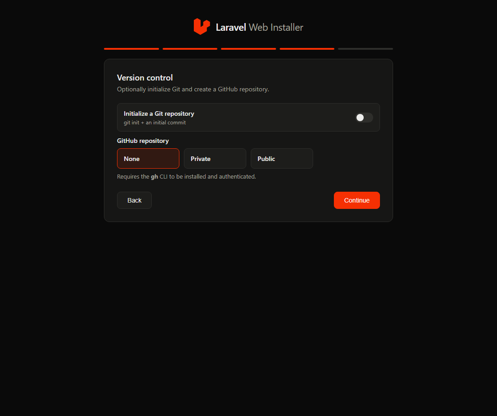
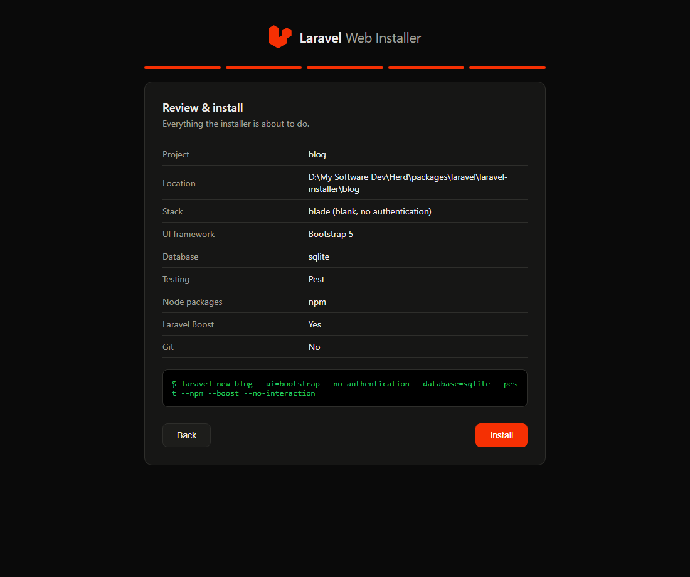
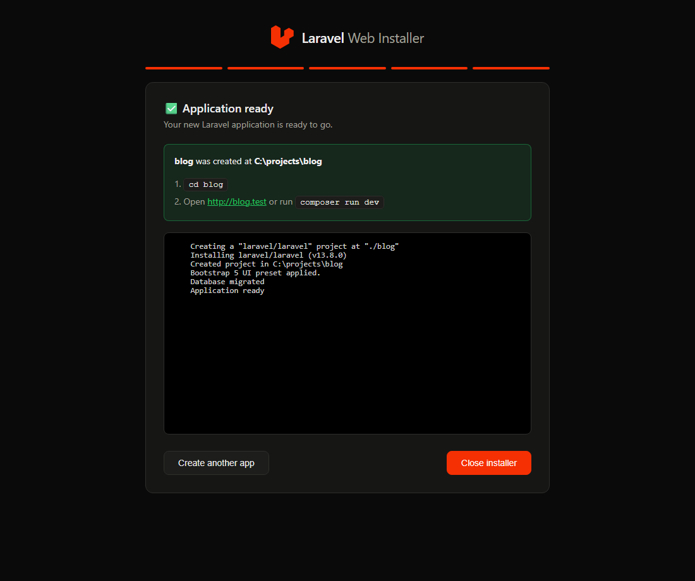

# Web installer

`laravel web` starts a browser-based local interface for creating Laravel applications. It is an alternative UI for `laravel new`, not a publicly hosted installer.



> The screenshots on this page are generated automatically from the live wizard by
> `npm run docs:screenshots` and kept in sync by the `screenshots.yml` workflow whenever
> the wizard source changes.

## Run it

```sh
cd path/to/projects
laravel web
```

The command starts PHP's built-in server on `127.0.0.1`, selects an available port from 8123 through 8199, opens the default browser, and prints the local URL. Supply `--port=8123` to choose a port or `--no-open` to stop it opening the browser automatically.

## Use through Laravel Herd

Link this repository in Herd with its document root set to public/. Start laravel web from the folder where new applications should be created, then open your Herd host (for example, https://laravel-installer.test). [public/index.php](../public/index.php) proxies that request to the active loopback-only installer process and rejects non-local requests. The public entry point returns a clear 503 message until laravel web is running.

The UI collects application name, starter kit, authentication, database, tests, Node manager, Boost, Git, and GitHub preferences, then displays the equivalent `laravel new` command. Click **Close installer** or use `Ctrl+C` in the terminal to stop the server.

## The wizard, step by step

Choose an official starter kit with authentication scaffolding, or start blank:



When the Blank setup with the Blade stack is selected, a **UI framework** choice appears: keep the default Tailwind skeleton, or apply a preset — Bootstrap 5, CoreUI 5, AdminLTE 4, the Laravel AdminLTE Composer package, or an Angular SPA scaffold (`--ui=bootstrap|coreui|adminlte|laravel-adminlte|angular`):



Database, testing, Node, and Boost options follow — database drivers whose PDO extension is missing are disabled:



Optionally initialize Git or publish straight to GitHub:



The review step shows everything the installer is about to do, including the exact equivalent CLI command:



The install log streams live into the browser, ending with the application URL and next steps:



## Behavior and requirements

- Projects are created in the directory where `laravel web` was run.
- Existing project directories and invalid names are rejected before install.
- Database choices without their required PDO extension are disabled.
- GitHub publishing needs the authenticated `gh` CLI.
- The server only binds to loopback; do not expose it through a proxy or share its URL.

The UI has no login or token because it is restricted to local loopback access. Treat it as a local development tool, not a multi-user service. On a failed install, read the terminal output in the progress panel, fix the Composer, Node, Git, or extension problem, and start another application.